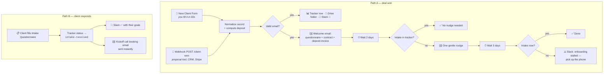

# 🚀 n8n Client Onboarding Autopilot

**Deal won → project set up → client briefed → paperwork chased → kickoff booked. Automatically.**

A free, importable [n8n](https://n8n.io) workflow for freelancers and
agencies that turns "the client said yes!" into a fully onboarded
project — tracker row, Drive folder, welcome email with contract and
deposit links, an intake questionnaire, polite automated nudges, and a
kickoff call booking — without you sending a single manual email. Hire AI automation experts from [REWORK](https://reworkdigital.io)

Companion to the [n8n Lead Generation Machine](https://github.com/gitslem/n8n-lead-generation-machine):
that one wins the client, this one onboards them.


---

## Why bother?

- Nearly half of freelancers spend **6+ hours every week** on
  non-billable admin — invoicing, chasing, and sending the same
  onboarding email for the twentieth time.
- Freelancers who automate intake, contracts, and follow-up report
  saving **8–15 hours per week**.
- The first week sets the tone for the whole engagement: a fast,
  organized onboarding is the cheapest retention tool you have — and a
  stalled one is a churn risk you want flagged early, not discovered
  at the deadline.

## How it works

Two independent paths in one workflow:



The nudge engine in Path A reads the tracker's `status` column before
every nudge, so the moment Path B flips it to `intake-received`, the
nudging stops on its own. If nothing arrives after the welcome email
plus one nudge (~5 days), you get a Slack alert to intervene
personally — because a stalled onboarding is a relationship problem,
not an email problem.

## Quick start

1. **Import** — in n8n: *Workflows → Import from File* →
   [`n8n-client-onboarding-autopilot.json`](n8n-client-onboarding-autopilot.json)
   (n8n Cloud or self-hosted, n8n ≥ 1.x).
2. **Attach credentials** (templates never carry credentials):

   | Nodes | Credential | Notes |
   |---|---|---|
   | 3× *Email* | SMTP | Or swap for Gmail / Outlook nodes |
   | 3× *Slack* | Slack API | Default channel `#clients` |
   | 3× *Tracker* | Google Sheets | See sheet setup below |
   | 1× *Drive Folder* | Google Drive | Or delete the node if you don't use Drive |

3. **Create the tracker sheet** — one Google Sheet with this header row
   (exact names, they match the workflow's field keys):

   ```
   clientName | clientEmail | company | projectName | projectType | fee | depositPercent | depositAmount | startDate | notes | validEmail | status | source | onboardedAt | goals | successCriteria | assetsLink | stakeholders | commsPreference | extraNotes | intakeReceivedAt
   ```

   Point all three Sheets nodes at it. The nudge engine reads the
   `status` column; the intake path matches rows on `clientEmail`.
4. **Personalize** — in the three email nodes replace `YOUR NAME`,
   `YOUR COMPANY`, the e-sign link, the payment link, and the
   `cal.com/YOUR-BOOKING-LINK` booking URL.
5. **Activate**, then open the *Client Intake Questionnaire* node, copy
   its **Form URL**, and paste it over `INTAKE_FORM_URL` in the welcome
   and nudge emails. Done.

## Feeding it clients

**A. The 60-second form** — open the *New Client Form* node, copy its
Form URL, and bookmark it. Fill it the moment a deal closes: client
name and email, project name and type, fee, deposit percentage, start
date. The deposit amount is calculated for you.

**B. The webhook** — wire your proposal tool, CRM stage change, or
Stripe checkout to `POST /webhook/client-won`:

```json
{
  "client_name": "Jane Smith",
  "client_email": "jane@acme.com",
  "company": "Acme Inc",
  "project_name": "Website revamp",
  "project_type": "Web design",
  "fee": 4800,
  "deposit_percent": 50,
  "start_date": "2026-08-01",
  "notes": "Referred by Tom"
}
```

Only `client_name`, `client_email`, and `project_name` really matter —
everything else defaults sensibly (deposit defaults to 50%).

## What the client experiences

1. **Minutes after saying yes:** a warm welcome email with exactly
   three next steps — intake questionnaire, agreement to sign, deposit
   invoice with the amount already calculated.
2. **A 5-minute questionnaire** that asks about goals, success
   criteria, assets, stakeholders, and how they like to communicate.
3. **Instantly after submitting:** a kickoff call booking link.
4. **If they stall:** one polite nudge — then a human (you) reaches
   out, prompted by the Slack alert.

Organized, fast, and personal where it counts. That's the impression
that wins referrals.

## Customizing

- **Timing** — the 2-day and 3-day waits are single parameters on the
  two Wait nodes.
- **More nudges** — copy the *Nudge → Wait → Check* trio to extend the
  chase before the stall alert fires.
- **Different storage** — swap the Sheets nodes for Airtable, Notion,
  or your CRM; keep a `status` field and match on `clientEmail` and the
  nudge engine keeps working.
- **Contract & invoice automation** — replace the static e-sign and
  payment links with Documenso/DocuSign and Stripe invoice nodes to
  generate both per-client.
- **AI kickoff prep** — add an LLM node after the intake path that
  turns the questionnaire answers into a kickoff agenda and a draft
  project brief in the client's Drive folder.
- **Project management** — add a node that creates the project in
  Trello/Asana/ClickUp alongside the Drive folder.

## KPIs worth tracking

| Metric | Healthy target |
|---|---|
| Deal won → welcome email | < 5 minutes (automatic) |
| Intake questionnaire completion rate | > 80% within 5 days |
| Deal won → kickoff call booked | < 7 days |
| Onboardings needing the stall alert | trending down |

## Repo contents

```
.
├── README.md                              ← you are here
└── n8n-client-onboarding-autopilot.json   ← import this into n8n
```

## License

MIT — free for personal and commercial use, including client work.
A star ⭐ is appreciated if this saved you a week of admin.
